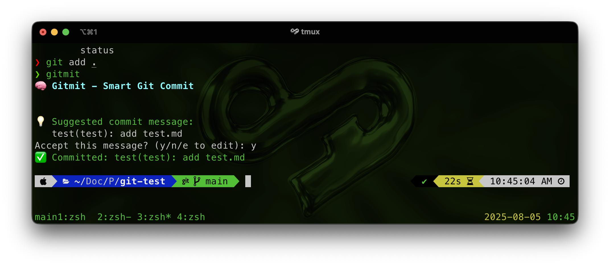

<div align="center">
  


[](https://golang.org)
[](https://opensource.org/licenses/MIT)
[](https://goreportcard.com/report/github.com/andev0x/gitmit)

</div>

# 🧠 Gitmit

Gitmit is a lightweight CLI tool that analyzes your staged changes and suggests professional commit messages following the Conventional Commits format.

## 🔍 Why Gitmit?

Ever struggled to write a clear and concise commit message? Gitmit simplifies this process by analyzing your changes and suggesting commit messages that adhere to industry standards.

## ✨ Features

- **Smart Analysis**: Understands your changes using `git status` and `git diff`
- **Conventional Commits**: Follows the standard format (e.g., `feat`, `fix`, `refactor`)
- **Interactive Mode**: Customize or accept suggestions interactively
- **Privacy First**: Operates entirely offline
- **Cross-Platform**: Works on Linux, macOS, and Windows

## 🚀 Installation

### Using Go Install
```bash
go install github.com/andev0x/gitmit@latest
```

### From Source
```bash
git clone https://github.com/andev0x/gitmit.git
cd gitmit
go build -o gitmit
sudo mv gitmit /usr/local/bin/
```

### Getting an OpenAI API Key :))

1. Visit the OpenAI website at [https://platform.openai.com/account/api-keys](https://platform.openai.com/account/api-keys).
2. If you don't have an account, click on "Sign Up" to create one. If you do, click "Log In".
3. Once logged in, navigate to your API key management page.
4. Click on "Create new secret key".
5. Enter a name for your new key, then click "Create secret key".
6. Your new API key will be displayed. Use this key to interact with the OpenAI API.

> **Note:** Your API key is sensitive information. Do not share it with anyone.


### Binary Releases
Download pre-built binaries from the [releases page](https://github.com/andev0x/gitmit/releases).

## 📖 Usage

### Basic Usage
```bash
# Stage your changes
git add .

# Run gitmit
gitmit
```

### Command Line Options
```bash
gitmit --help      # Show help message
gitmit --version   # Show version number
gitmit --dry-run   # Show suggestion without committing
gitmit --verbose   # Show detailed analysis
```

## 🤝 Contributing

We welcome contributions! Please see the [Contributing Guide](CONTRIBUTING.md) for details.

### Development Setup
```bash
# Clone the repository
git clone https://github.com/andev0x/gitmit.git
cd gitmit

# Install dependencies
go mod download

# Run tests
go test ./...

# Build the project
go build -o gitmit

# Run locally
./gitmit --help
```

## 📄 License

This project is licensed under the MIT License. See the [LICENSE](LICENSE) file for details.

## 🙏 Acknowledgments

- Inspired by [Conventional Commits](https://www.conventionalcommits.org/)
- Built with [Cobra CLI](https://github.com/spf13/cobra)
- Colored output by [Fatih Color](https://github.com/fatih/color)

---

**Made with ❤️ by the open source community**

**Author** [@github](https://github.com/andev0x)


If you find Gitmit useful, please consider giving it a ⭐ on GitHub!
